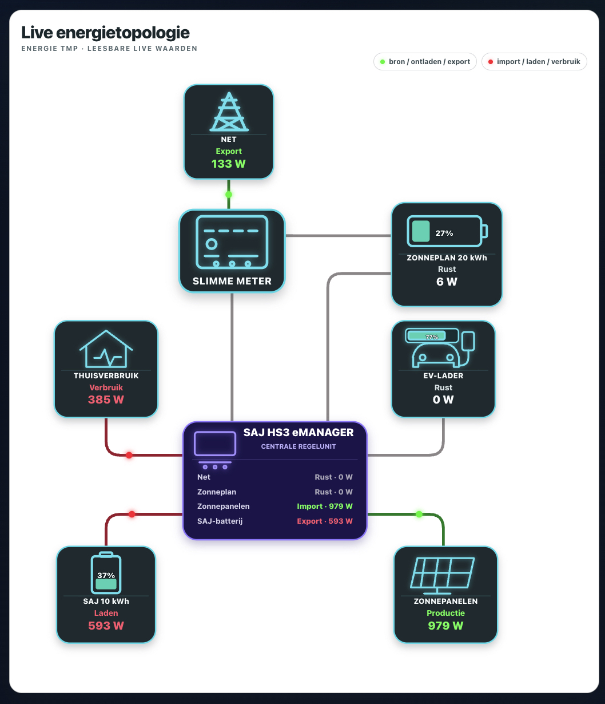

# SAJ HS3 / eManager for Home Assistant


A read-only Home Assistant integration for supported SAJ HS3 systems with an
eManager. It uses local BLE communication through Home Assistant Bluetooth or
an ESPHome Bluetooth Proxy. Sensor semantics are based on documented SAJ
definitions and extensive validation against a live HS3 installation.

The integration deliberately exposes only allowlisted, verified reads. Hardware,
installation topology and firmware variants can differ, so this project does not
claim compatibility with every SAJ installation and is not officially supported
or endorsed by SAJ.

## Supported hardware

- Home Assistant 2025.1 or newer;
- a SAJ HS3 installation with an eManager advertising as `eManager:*`;
- a connectable Bluetooth path from Home Assistant, normally an ESPHome
  Bluetooth Proxy placed within reliable BLE range;
- an integrated SAJ EV charger is optional. Its three entities are available
  only when the eManager returns a valid `CHARGERINFO` response.

The implementation has been validated on real HS3/eManager hardware. Different
firmware revisions, regional variants and wiring topologies may expose different
values or omit optional fields.

## Architecture and local data path

```text
Home Assistant
  -> custom integration: saj_hs3
  -> Home Assistant Bluetooth stack
  -> ESPHome Bluetooth Proxy (BLE transport only)
  -> Bluetooth GATT / BSaj
  -> SAJ eManager
  -> HS3 EMS, inverter, battery, PV and optional EV data
```

The ESP32 proxy only transports BLE traffic. It does not interpret SAJ data and
does not need RS485, UART or Modbus wiring to the inverter or eManager. The
integration performs the fixed BSaj requests, validates the responses and maps
them to Home Assistant entities.

The local route does not require the Elekeeper cloud, an Android phone or the
Elekeeper app. The fixed `transModbus` reads documented below are carried inside
the local BLE/BSaj session; ordinary Modbus TCP on port 502 is not used.

## Installation

### HACS

1. Open HACS and choose **Custom repositories**.
2. Add `https://github.com/harkoijkema/ha-saj-hs3` as type **Integration**.
3. Download **SAJ HS3 / Elekeeper**.
4. Restart Home Assistant.
5. Open **Settings -> Devices & services -> Add integration**.
6. Select **SAJ HS3 / Elekeeper**.
7. Choose **Local eManager** and select the discovered device.

The integration domain is `saj_hs3`. Remove an obsolete manually copied
`custom_components/saj_elekeeper` directory before installation.

### Manual installation

Copy `custom_components/saj_hs3` into the `custom_components` directory in your
Home Assistant configuration, restart Home Assistant and add the integration
from the UI.

## Configuration

The recommended source is **Local eManager**. Home Assistant must first see a
connectable advertisement whose name starts with `eManager:`. When several
Bluetooth adapters or proxies see the device, Home Assistant selects the best
available route.

**Elekeeper Open Platform** is an optional secondary source. It accepts the App
ID and App Secret of a released developer app and currently performs only the
confirmed read-only authentication and authorized-plant-count health check. It
does not create the 52 local sensor entities. A normal Elekeeper username and
password is never requested. Access tokens remain in memory; diagnostics report
only whether credentials are present, never their values.

## Sensor reference

The current code defines exactly **52 local sensor entities**. The canonical,
stable identifier below is the entity-description key used in the unique ID.
Home Assistant creates the visible `entity_id` from the device and translated
friendly name; it can therefore differ by language or be renamed by the user.
The examples assume an English installation, such as
`sensor.saj_emanager_pv_power`.

### EMS realtime and totals

| Entity key / typical entity | Friendly name | Unit | Meaning and sign | Source |
|---|---|---:|---|---|
| `pv_power` / `sensor.saj_emanager_pv_power` | PV power | W | Current PV production; normally non-negative | EMS ID `39`, native W |
| `battery_power` / `sensor.saj_emanager_battery_power` | Battery power | W | Non-negative magnitude; combine with `battery_direction_code` | EMS ID `40`, absolute native W |
| `battery_soc` / `sensor.saj_emanager_battery_state_of_charge` | Battery state of charge | % | Battery system SOC | EMS ID `41`, native % |
| `grid_power` / `sensor.saj_emanager_grid_power` | Grid power | W | Non-negative magnitude; combine with `grid_direction_code` | EMS ID `44`, absolute native W |
| `load_power` / `sensor.saj_emanager_house_load_power` | House load power | W | Broad SAJ load reported by the EMS; it can include the integrated EV charger and is not guaranteed to be house-only | EMS ID `45`, native W |
| `pv_energy_total` / `sensor.saj_emanager_pv_energy_total` | PV energy total | kWh | Cumulative PV energy | EMS ID `55`, native kWh |
| `battery_charge_energy_total` / `sensor.saj_emanager_battery_charge_energy_total` | Battery charge energy total | kWh | Cumulative energy charged into the SAJ battery | EMS ID `59`, native kWh |
| `battery_discharge_energy_total` / `sensor.saj_emanager_battery_discharge_energy_total` | Battery discharge energy total | kWh | Cumulative energy discharged from the SAJ battery | EMS ID `63`, native kWh |
| `grid_export_energy_total` / `sensor.saj_emanager_grid_export_energy_total` | Grid export energy total | kWh | Cumulative export measured by the SAJ EMS boundary | EMS ID `79`, native kWh |
| `grid_import_energy_total` / `sensor.saj_emanager_grid_import_energy_total` | Grid import energy total | kWh | Cumulative import measured by the SAJ EMS boundary | EMS ID `75`, native kWh |
| `load_energy_total` / `sensor.saj_emanager_load_energy_total` | Load energy total | kWh | Cumulative broad SAJ load energy; validated installations can include integrated EV charging | EMS ID `83`, native kWh |
| `ems_operating_strategy` / `sensor.saj_emanager_ems_operating_strategy` | EMS operating strategy | text | Raw current EMS strategy string | EMS ID `102`, diagnostic |
| `pv_direction_code` / `sensor.saj_emanager_pv_direction_code` | PV direction code | code | Raw diagnostic direction code; do not use as a generic binary status | EMS ID `33` |
| `battery_direction_code` / `sensor.saj_emanager_battery_direction_code` | Battery direction code | code | `-1` charging, `+1` discharging on the validated HS3 | EMS ID `34` |
| `grid_direction_code` / `sensor.saj_emanager_grid_direction_code` | Grid direction code | code | `-1` import from grid, `+1` export to grid on the validated HS3 | EMS ID `35` |
| `load_direction_code` / `sensor.saj_emanager_load_direction_code` | Load direction code | code | Raw load-direction diagnostic; not a house/EV discriminator | EMS ID `36` |

### Battery and inverter `transModbus` fields

| Entity key / typical entity | Friendly name | Unit | Meaning and sign | Source / scale |
|---|---|---:|---|---|
| `battery_power_signed` | Battery power (signed) | W | Signed battery power from a later Modbus response; negative charging and positive discharging on the validated HS3. Cross-check firmware variants against the EMS direction code | BLE `transModbus` FC03 `0x4055`, signed 16-bit, 1 W |
| `battery_installed_capacity` | Battery installed capacity | kWh | Configured battery-system capacity | FC33 `0x0400`, unsigned 32-bit `/1000` |
| `battery_current` | Battery current | A | Signed raw battery current; direction should be checked against battery power/code | FC35 `0x6506`, signed `/10` |
| `battery_voltage` | Battery voltage | V | Battery-system voltage | FC35 `0x6506`, unsigned `/10` |
| `inverter_type` | Inverter type | text | Raw inverter type as hexadecimal code | FC03 `0x8F00`, `0xNNNN` |
| `inverter_rated_power` | Inverter rated power | W | Inverter rated power | FC03 `0x8F00`, 1 W |
| `inverter_protocol_version` | Inverter protocol version | value | Numeric protocol version | FC03 `0x8F00`, `/1000` |

### PV strings

| Entity key | Friendly name | Unit | Meaning and sign | Source / scale |
|---|---|---:|---|---|
| `pv1_voltage` | PV1 voltage | V | PV input 1 voltage | FC03 `0x4055`, `/10` |
| `pv1_current` | PV1 current | A | PV input 1 current | FC03 `0x4055`, `/100` |
| `pv1_power` | PV1 power | W | PV input 1 power | FC03 `0x4055`, 1 W |
| `pv2_voltage` | PV2 voltage | V | PV input 2 voltage | FC03 `0x4055`, `/10` |
| `pv2_current` | PV2 current | A | PV input 2 current | FC03 `0x4055`, `/100` |
| `pv2_power` | PV2 power | W | PV input 2 power | FC03 `0x4055`, 1 W |

### Grid-side three-phase AC

| Entity key | Friendly name | Unit | Meaning and sign | Source / scale |
|---|---|---:|---|---|
| `grid_voltage_l1` | Grid voltage L1 | V | Grid-side L1 voltage | FC03 `0x4031`, `/10` |
| `grid_current_l1` | Grid current L1 | A | Signed grid-side L1 current | FC03 `0x4031`, signed `/100` |
| `grid_power_l1` | Grid power L1 | W | Signed raw L1 active power; use the EMS grid direction for canonical import/export | FC03 `0x4031`, signed 1 W |
| `grid_voltage_l2` | Grid voltage L2 | V | Grid-side L2 voltage | FC03 `0x4031`, `/10` |
| `grid_current_l2` | Grid current L2 | A | Signed grid-side L2 current | FC03 `0x4031`, signed `/100` |
| `grid_power_l2` | Grid power L2 | W | Signed raw L2 active power; use the EMS grid direction for canonical import/export | FC03 `0x4031`, signed 1 W |
| `grid_voltage_l3` | Grid voltage L3 | V | Grid-side L3 voltage | FC03 `0x4031`, `/10` |
| `grid_current_l3` | Grid current L3 | A | Signed grid-side L3 current | FC03 `0x4031`, signed `/100` |
| `grid_power_l3` | Grid power L3 | W | Signed raw L3 active power; use the EMS grid direction for canonical import/export | FC03 `0x4031`, signed 1 W |
| `grid_frequency` | Grid frequency | Hz | Grid frequency; availability can depend on HS3 model/condition | FC03 `0x4031`, `/100` |

### Backup/output three-phase AC

| Entity key | Friendly name | Unit | Meaning and sign | Source / scale |
|---|---|---:|---|---|
| `backup_voltage_l1` | Backup voltage L1 | V | Backup/output L1 voltage | FC03 `0x4055`, `/10` |
| `backup_current_l1` | Backup current L1 | A | Signed backup/output L1 current | FC03 `0x4055`, signed `/100` |
| `backup_power_l1` | Backup power L1 | W | Backup/output L1 power | FC03 `0x4055`, 1 W |
| `backup_voltage_l2` | Backup voltage L2 | V | Backup/output L2 voltage | FC03 `0x4055`, `/10` |
| `backup_current_l2` | Backup current L2 | A | Signed backup/output L2 current | FC03 `0x4055`, signed `/100` |
| `backup_power_l2` | Backup power L2 | W | Backup/output L2 power | FC03 `0x4055`, 1 W |
| `backup_voltage_l3` | Backup voltage L3 | V | Backup/output L3 voltage | FC03 `0x4055`, `/10` |
| `backup_current_l3` | Backup current L3 | A | Signed backup/output L3 current | FC03 `0x4055`, signed `/100` |
| `backup_power_l3` | Backup power L3 | W | Backup/output L3 power | FC03 `0x4055`, 1 W |
| `backup_frequency` | Backup frequency | Hz | Backup/output frequency | FC03 `0x4055`, `/100` |

### Optional integrated EV charger

| Entity key / typical entity | Friendly name | Unit | Meaning and sign | Source / scale |
|---|---|---:|---|---|
| `ev_charger_status_raw` / `sensor.saj_ev_charger_ev_charger_status_code` | EV charger status code | code | Raw vendor status code; deliberately not converted to unverified connected/charging enums | Fixed read-only `AT+CHARGERINFO?` |
| `ev_charger_power` / `sensor.saj_ev_charger_ev_charging_power` | EV charging power | W | Current positive charging load | `chargerInfo.power`, native W |
| `ev_charger_total_energy` / `sensor.saj_ev_charger_ev_total_charging_energy` | EV total charging energy | kWh | Cumulative EV charging energy | `chargerInfo.totalEnergy / 1000` |

All six EMS energy totals use `state_class: total`, not `total_increasing`.
Their reset and rollover behavior is not sufficiently proven for every supported
firmware. Treat them as raw device totals and validate any utility-meter or
long-term accounting built on top of them.

## Direction conventions

| Flow | Magnitude sensor | Direction | Canonical signed interpretation |
|---|---|---|---|
| SAJ grid | `grid_power` | `grid_direction_code = -1` | positive import/consumption from grid |
| SAJ grid | `grid_power` | `grid_direction_code = +1` | negative import, meaning export to grid |
| SAJ battery | `battery_power` | `battery_direction_code = -1` | negative supply, meaning battery charging |
| SAJ battery | `battery_power` | `battery_direction_code = +1` | positive supply, meaning battery discharging |

For the validated installation:

```text
grid_supply_signed    = -grid_direction_code * grid_power
battery_supply_signed =  battery_direction_code * battery_power
```

Do not infer flow direction from the non-negative magnitude sensors alone.
Zonneplan/Nexus conventions shown in the dashboard screenshot belong to the
developer's wider installation and are not part of `saj_hs3`.

## Polling and acquisition behavior

- The public code configures a 60-second coordinator update interval.
- A persistent GATT/BSaj session is reused. A new session performs two identity
  reads plus the normal cycle; a reused session performs eight serial reads.
- The normal cycle order is: realtime EMS batch, energy EMS batch, five fixed
  `transModbus` blocks, then optional `CHARGERINFO`.
- All resulting entities are published together only after the cycle completes.
  Publication together does **not** mean the sources were acquired atomically.
- Realtime EMS values share one response. Energy totals share a later response.
  Every Modbus block has its own response, and EV data is read last.
- On the validated hardware a complete reused cycle typically took about 7-9
  seconds, so start-to-start cadence is longer than the configured interval.
- The current public code does not expose per-batch acquisition timestamps as
  entity attributes. Privacy-safe diagnostics expose the cycle start and the
  coordinator's last successful publication time. `last_updated` is a Home
  Assistant publication timestamp, not a physical measurement timestamp.
- If the optional charger query fails, the three EV entities become unavailable
  while core fields remain available; charger probing is then paused for 900
  seconds before retrying.

This non-atomic acquisition is important when building instantaneous energy
balances, particularly during battery or EV start/stop transitions.

## Known limitations and issues

- `load_power` (EMS ID `45`) is a broad SAJ load value. Live validation proved
  that it can include the integrated EV charger. Do not label it or use it as a
  universally house-only/excluding-EV measurement.
- `load_energy_total` is likewise the cumulative broad load boundary and can
  include integrated EV energy. It is not the P1 contract boundary.
- EMS direction and magnitude fields can become internally inconsistent around
  fast transitions. Avoid treating one transient sample as a complete physical
  balance.
- EMS, the five Modbus blocks and `CHARGERINFO` are serial reads rather than one
  atomic snapshot.
- The EV interface exposes only raw status, current charging power and cumulative
  charging energy. It does not expose proven session/daily energy, phases or
  charging costs.
- Individual battery-module data, module temperatures and SOH are not exposed.
- Energy-total reset and rollover semantics can vary and are not generalized.
- Bluetooth availability depends strongly on range, interference, proxy firmware
  and whether a connectable advertisement is visible.
- Other HS3/eManager firmware and hardware revisions may omit fields or use
  different semantics. Open an issue with privacy-safe diagnostics if your
  installation differs.
- The integration is read-only. EV start/stop, inverter settings, battery control
  and undocumented write commands are intentionally outside scope.

## Example energy dashboard



This screenshot is an example of what can be built from `saj_hs3` sensors plus
other installation-specific sources. It is not created automatically by the
integration. In this example:

- green means source, battery discharge or export;
- red means import, battery charge or consumption;
- grey means idle;
- moving dots show current direction;
- animation speed can be linked to power.

The developer dashboard also uses a P1 meter, an external battery meter, EV SOC
and template/accounting entities. P1, Zonneplan/Nexus, financial calculations
and V3 accounting are **not** part of `saj_hs3`.

The approved responsive card is available as
[`examples/live_energy_topology.yaml`](examples/live_energy_topology.yaml). It
contains the desktop/laptop, phone/mobile and iPad/tablet-landscape layouts, CSS
Motion Path animation for modern browsers and the SVG SMIL fallback used by
Safari 15/iPadOS 15. Replace all `sensor.example_*` placeholders by following
the [entity mapping](examples/README.md). The example requires
[`custom:button-card`](https://github.com/custom-cards/button-card).

## Troubleshooting

### The eManager is not discovered

1. Confirm that the ESPHome Bluetooth Proxy is online and active connections are
   enabled.
2. Confirm that Home Assistant's Bluetooth integration sees a connectable
   `eManager:*` advertisement.
3. Move the proxy closer and reduce interference. A weak advertisement can be
   visible but still fail to sustain GATT traffic.
4. Reload the integration only after the Bluetooth path is healthy. Rebooting the
   eManager is not a normal first recovery step.

No RS485/Modbus wiring to the ESP32 is required, and the local data route does
not require Elekeeper cloud connectivity.

### Entities are unavailable or update at different times

- Open the integration diagnostics and inspect `source_status`,
  `last_successful_update`, `local_connection_source` and `local_cycle.stage`.
- Check whether only the optional EV entities are unavailable; a failed charger
  read intentionally does not discard the core EMS/Modbus result.
- Remember that source blocks are read serially and can represent different
  physical instants even though entities are published together.
- Do not use the entities' `last_updated` value as an acquisition timestamp.
- If failures persist, inspect Home Assistant Bluetooth/proxy logs and verify
  range before repeatedly restarting components.

When opening a GitHub issue, remove Bluetooth addresses, serial numbers,
credentials, tokens, plant identifiers and raw private captures.

## Technical background

The local client establishes an encrypted BSaj session over the eManager GATT
service. Requests are constrained to two fixed EMS data-ID batches, five exact
read-only `transModbus` blocks and the optional fixed `AT+CHARGERINFO?` query.
Responses are structurally validated before values are published. Unsupported
data IDs, arbitrary Modbus blocks and generic AT commands are not exposed.

Privacy-safe Home Assistant diagnostics include source status, lifecycle stage,
request count, connection attempts and direction observations without exposing
addresses, device identifiers, credentials or raw measurements.

## Safety and read-only guarantee

The integration contains no service or control entity and does not offer a raw
command surface. State-changing Modbus function codes are excluded. It does not
write inverter, grid, battery or EV-charger settings. Do not add or test
undocumented write commands through this project.

## HACS and releases

HACS renders this README as the integration documentation. The repository can be
installed as a custom HACS repository using the steps above. Documentation-only
changes on the default branch do not require an integration version bump. When
the repository publishes GitHub Releases, HACS uses the tag of the latest
published release as its remote version; a tag by itself is not a release.

## Branding

The SAJ HS3 icon above is also shipped as local integration brand imagery in
`custom_components/saj_hs3/brand/`. Home Assistant 2026.3 and newer can use
these local assets. For the HACS catalogue and Home Assistant versions before
2026.3, the corresponding `custom_integrations/saj_hs3` assets must additionally
be accepted by the separate
[Home Assistant Brands repository](https://github.com/home-assistant/brands).

## License, branding and disclaimer

This project is released under the [MIT License](LICENSE).

The bundled SAJ HS3 product icon is used solely to identify the integration. It
does not imply endorsement. SAJ, Elekeeper and related product names and marks
belong to their respective owners. Use the integration and dashboard examples at
your own risk and verify measurements against your own hardware before using
them for billing, safety or control decisions.

## Development checks

```bash
python -m pytest
ruff check .
ruff format --check .
mypy custom_components/saj_hs3
```

GitHub Actions additionally run HACS validation and hassfest. Private research,
captures, credentials, device identifiers and unpublished register material are
not part of this public repository.
